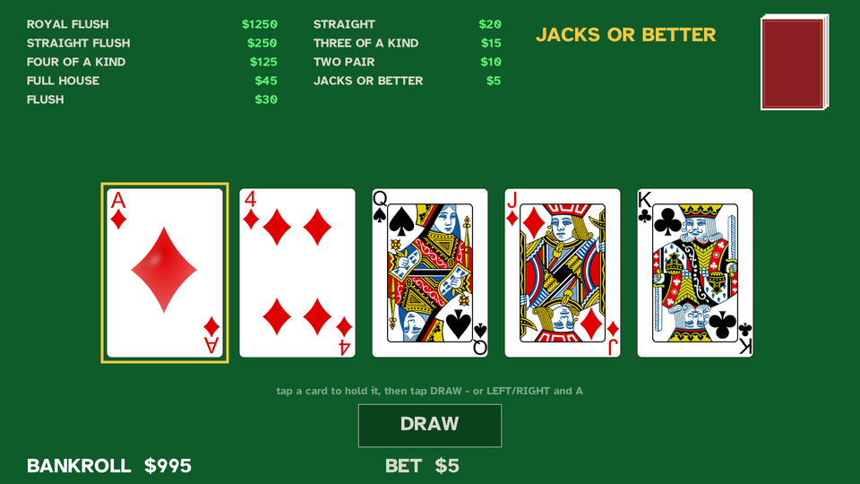
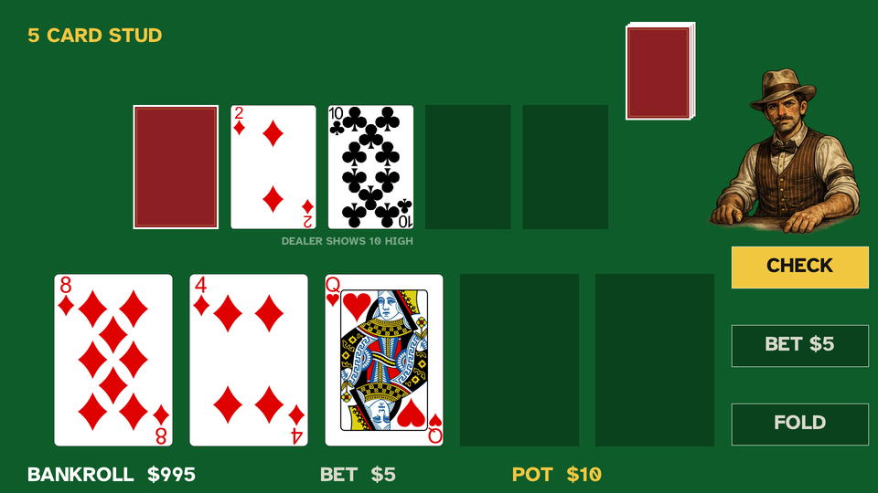
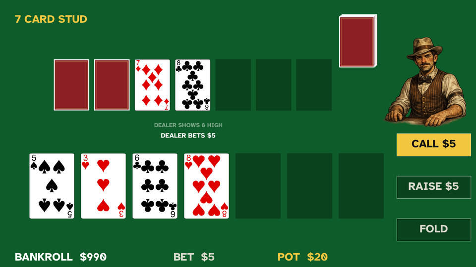
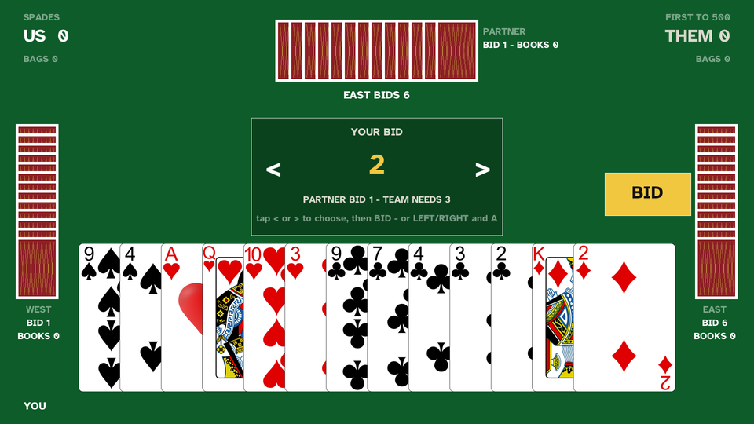
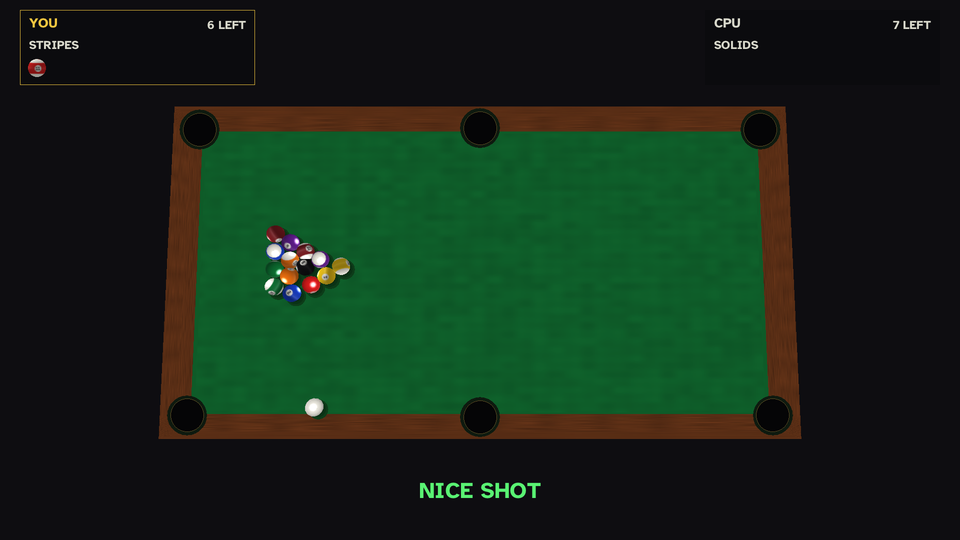
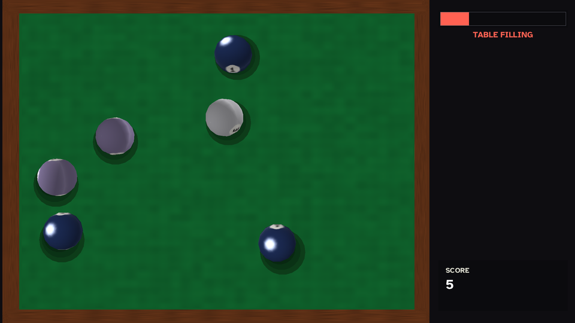

# Games for Dad

Original games built for my dad: 85 years old, playing on a TV from the
couch with a gamepad. Four card games and two played with a cue. Every
design decision follows from that player: no timers, no bust-outs, no
button chords, big readable type.

The games are [wasmcart](https://www.npmjs.com/package/wasmcart) carts
written in Lua. Each one is a single portable `.wasc` file that runs anywhere the
wasmcart player runs.

## The games

Every shot below is the real game running, captured through romdev.

### Jacks or Better &mdash; `jacksorbetter/`

Classic video poker. Hold, draw, win on a pair of jacks or better.



### Five Card Stud &mdash; `fivecardstud/`

Heads-up stud against the dealer. One hole card, bet street by street.



### Seven Card Stud &mdash; `sevencardstud/`

The full game: two down, four up, one more down, best five of seven.



### Spades &mdash; `spades/`

Partnership Spades: you and a CPU partner against two CPUs. Books, bags,
nil, first team to 500.



### Eight Ball &mdash; `eightball/`

3D top-down 8-ball against the house. Aim, draw the cue back, let it go.
Real rigid-body physics with measured billiard constants, so a struck ball
rolls rather than slides.



### Combo &mdash; `combo/`

Shoot marbles across a field; two of the same colour merge into the next
colour up. Seven tiers, and merging the top one clears the board. There is
no timer: the life bar IS how crowded the table is, and a junk marble costs
the most to keep while being worth the least, so clearing clutter and
scoring are the same move.



## Playing

```
npx wasmcart jacksorbetter/jacksorbetter.wasc
```

The carts are 1920x1080 and declare it in their own `conf.lua`, so they
render the same on any engine build.

**On Android**, each game is its own app. `wasmcart-android-lua` turns a
cart into an installable APK -- `./build-game-apk.sh <game>.wasc` -- using
the `icon.png` beside the cart for the launcher icon and the cart's
manifest for the app's name and version. Those builds run the engine as
native code rather than wasm: about 6 MB per game instead of 64, at a
locked 60 fps.

**Eight Ball and Combo are the odd ones out on controls**, because a cue is
not a card: LEFT/RIGHT swing the aim, UP/DOWN draw the cue back, and the
confirm button strikes. How far the cue is drawn back IS the power, and the
stick fades cream to red as it grows, so there is no meter to read and
nothing timed.
On a phone the same shot is one gesture: drag away from the ball to aim and
load it, lift your finger to shoot.

Controls, in every game:

- **D-pad LEFT/RIGHT** (and UP/DOWN where the layout calls for it) moves
  the gold highlight.
- **South or east face button** confirms. Both always work; there is no
  wrong confirm button.
- That is the entire pad scheme.

**Touch is an equal path, not an afterthought.** On a phone or tablet the
pad does not exist, so every game takes taps for everything: tap a card to
pick it, tap the big gold button to commit it (PLAY / DRAW / DEAL /
CHECK / BET / FOLD), tap the bid spinner's left and right thirds in
Spades. Buttons are spread out with dead space between them because a
wrong tap costs a hand, and every press lands on screen the instant it
happens -- a silent half second reads as a dead button. All ten pointer
slots are polled, so touch works, not just a mouse.

Money rules, in every poker game: $1000 stack, $5 flat bet, and the
bankroll can never bust. If you cannot cover the next bet, the house
refills you with a fresh stack, cheerfully. Spades keeps score in
points instead — its native currency — first team to 500, same laws
mapped onto the scoreboard (wins loud, losses quiet, nothing shames).

## Repo layout

- `<game>/app/` - the game's Lua source and assets (self-contained),
  including a `conf.lua` declaring the cart's 1920x1080
- `<game>/icon.png` - launcher icon for the Android build (1024 adaptive
  foreground)
- `tools/` - headless drivers used to verify a change without a device
- `<game>/main.wasm` - the wasmcart-lua engine the cart ships with
- `<game>/<game>.wasc` - the packed, playable cart
- `common/` - the shared card-table library and assets the games are
  built from (`common/sync.sh <game>` copies them into a cart)
- `docs/` - how the games are built, the architecture, and the design
  rules ([start here](docs/MAKING_GAMES.md))

## Rebuilding a cart

```
cd jacksorbetter
npx wasmcart pack --wasm main.wasm --assets app \
  --name "Jacks or Better" --width 1920 --height 1080 \
  -o jacksorbetter.wasc
```

## License and credits

Code is [MIT](LICENSE).

- Card faces: Byron Knoll's public-domain (CC0) vector playing cards
  (the full-court J/Q/K variants), pre-scaled to the exact drawn size.
- Sounds: card and chip one-shots from Kenney's CC0 audio packs.
- Font: Atkinson Hyperlegible Bold, by the Braille Institute. The font
  remains under its own SIL Open Font License. Chosen because it is
  designed for low-vision readers.
