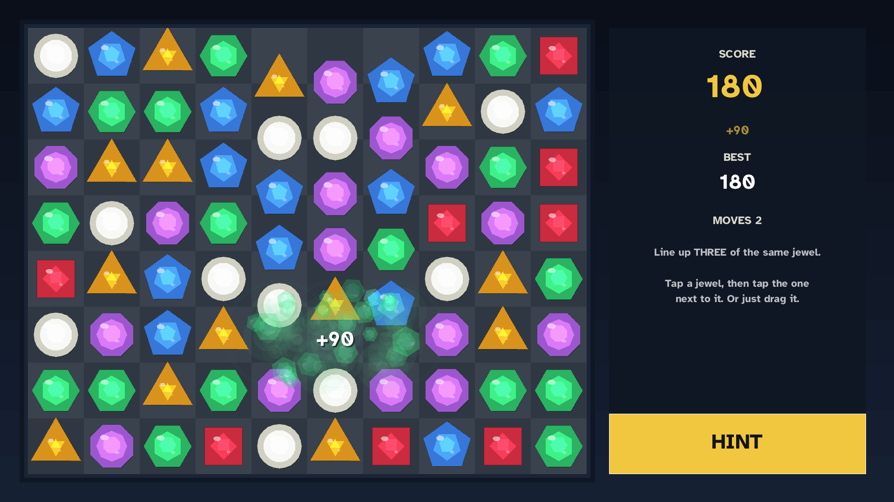
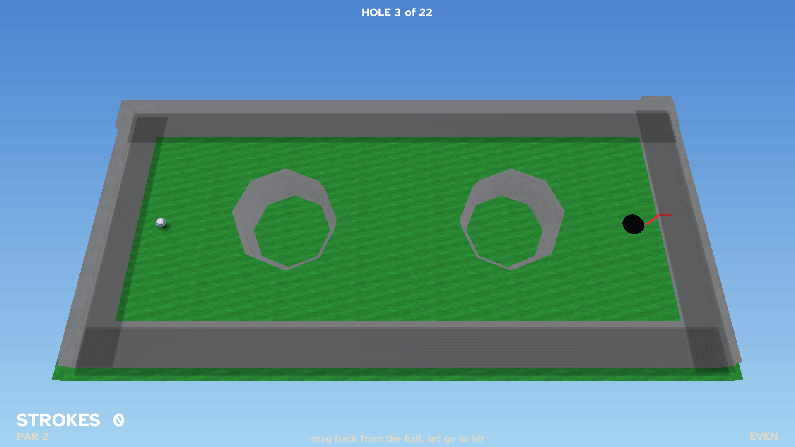

# Games for Dad

Original games built for my dad: 85 years old, playing on a TV from the
couch with a gamepad. Four card games, two played with a cue, a
match-three and a round of mini golf. Every design decision follows from
that player: no timers, no bust-outs, no button chords, big readable type.

The games are [wasmcart](https://www.npmjs.com/package/wasmcart) carts
written in Lua. Each one is a single portable `.wasc` file that runs anywhere the
wasmcart player runs.

## The games

Every shot below is the real game running, captured through romdev.

### Jacks or Better &mdash; `jacksorbetter/`

Classic video poker. Hold, draw, win on a pair of jacks or better.


### Five Card Stud &mdash; `fivecardstud/`

Heads-up stud against the dealer. One hole card, bet street by street.


### Seven Card Stud &mdash; `sevencardstud/`

The full game: two down, four up, one more down, best five of seven.


### Spades &mdash; `spades/`

Partnership Spades: you and a CPU partner against two CPUs. Books, bags,
nil, first team to 500.


### Eight Ball &mdash; `eightball/`

3D top-down 8-ball against the house. Aim, draw the cue back, let it go.
Real rigid-body physics with measured billiard constants, so a struck ball
rolls rather than slides.


### Combo &mdash; `combo/`

Shoot marbles across a field; two of the same colour merge into the next
colour up. Seven tiers, and merging the top one clears the board. There is
no timer: the life bar IS how crowded the table is, and a junk marble costs
the most to keep while being worth the least, so clearing clutter and
scoring are the same move.

**The merge mechanic is [NuSan](https://nusan.itch.io/)'s**, from
[Combo Pool](https://www.lexaloffle.com/bbs/?tid=3467) (PICO-8, p8jam2
2019) — including the idea that the life bar should measure clutter rather
than time, and the cubic curve that makes it relaxed until it suddenly is
not. That design is the good part of this game and it is not ours. Our own
code, layout (a 4:3 field shot from the right, rather than a square arena
shot from the bottom), 3D rendering and physics are original.


### Jewels &mdash; `jewels/`

Match three. Swap two neighbouring jewels to line up three of a kind; they
burst, the ones above fall in, and if that lines up three more it keeps
going on its own.

**There is no clock, and that is the whole point.** The board does not move
unless he moves it, so he can study it for two minutes, get up for coffee
and come back to the same position. An illegal swap springs back and costs
nothing, the hint is free and unlimited, and a board with no moves left
quietly reshuffles itself rather than ending the game.

Ten by eight at 120px cells, and each of the six jewels is a **different
shape** as well as a different colour, so the board still reads if colour
does not.



### Minigolf &mdash; `minigolf/`

Twenty-two holes. Drag back from the ball to aim and load, let go to hit.
Water costs a stroke and replays from where you were; sand slows you down;
the yellow pads push you the way their arrows point.

**No stroke limit and no losing score.** Par is shown because it is
interesting, never as a threshold. The original refuses the cup above a
speed limit, so a firm putt that goes in gets rejected -- here it drops
and rattles in.

**The hole layouts are [frozenjs/minigolf](https://github.com/frozenjs/minigolf)'s**
(MIT, Iced Development LLC), converted from that game's own level data by
`tools/convert-levels.mjs` -- 431 pieces of collision geometry across 22
holes. The three sounds are its own too. Everything else here is new.

**It is full 3D with 3D physics.** Box3D simulates a real sphere rolling on
a real surface, so the ball's spin comes out of the solver as an actual
quaternion rather than being derived from how far it travelled. Every
entity produces both a mesh and a collision shape from the same numbers, so
what you see is exactly what the ball hits.

The look follows Neverputt: textured turf with mower stripes, grey concrete
walls, a soft contact shadow under the ball and beside every rail. All of
it is generated at load in `app/art.lua` -- including the lighting, which
is baked into one texture variant per face direction because this engine's
3D path has no runtime lighting at all.



## Playing

```
npx wasmcart jacksorbetter/jacksorbetter.wasc
```

The carts are 1920x1080 and declare it in their own `conf.lua`, so they
render the same on any engine build.

The four card games ship a packed `.wasc` in the repo. **Eight Ball, Combo,
Jewels and Minigolf are built from source** -- their `.wasc` and engine copy are
build artifacts, not committed -- so run `./build.sh` in the game's
directory first (it needs a `wasmcart-lua` checkout beside this repo, or
`WASMCART_LUA=` pointing at one).

**On Android**, each game is its own app. `wasmcart-android-lua` turns a
cart into an installable APK -- `./build-game-apk.sh <game>.wasc` -- using
the `icon.png` beside the cart for the launcher icon and the cart's
manifest for the app's name and version. Those builds run the engine as
native code rather than wasm: about 6 MB per game instead of 64, at a
locked 60 fps.

**Eight Ball, Combo and Minigolf are the odd ones out on controls**, because
a cue is not a card: LEFT/RIGHT swing the aim, UP/DOWN draw the cue back, and the
confirm button strikes. How far the cue is drawn back IS the power, and the
stick fades cream to red as it grows, so there is no meter to read and
nothing timed.
On a phone the same shot is one gesture: drag away from the ball to aim and
load it, lift your finger to shoot.

Controls, in every game:

- **D-pad LEFT/RIGHT** (and UP/DOWN where the layout calls for it) moves
  the gold highlight.
- **South or east face button** confirms. Both always work; there is no
  wrong confirm button.
- That is the entire pad scheme.

**Minigolf uses the same language as the cue games**: LEFT/RIGHT aim,
DOWN pulls the putter back, and the confirm button strikes. On touch, drag
back from the ball and let go -- the drag IS the shot, reversed, exactly
like drawing a real putter.

**Jewels adds one idea to it**, because a grid is not a list: confirm picks
a jewel *up*, and then a DIRECTION swaps it that way. One press, one push,
done -- rather than a pick-then-move-then-confirm-again dance that is easy
to get lost in halfway through. Pressing confirm again on the same jewel
puts it back down. Its hint also has its own button (X or Y), so help is
always one press away no matter where the cursor is.

**Touch is an equal path, not an afterthought.** On a phone or tablet the
pad does not exist, so every game takes taps for everything: tap a card to
pick it, tap the big gold button to commit it (PLAY / DRAW / DEAL /
CHECK / BET / FOLD), tap the bid spinner's left and right thirds in
Spades. Buttons are spread out with dead space between them because a
wrong tap costs a hand, and every press lands on screen the instant it
happens -- a silent half second reads as a dead button. All ten pointer
slots are polled, so touch works, not just a mouse.

Money rules, in every poker game: $1000 stack, $5 flat bet, and the
bankroll can never bust. If you cannot cover the next bet, the house
refills you with a fresh stack, cheerfully. Spades keeps score in
points instead — its native currency — first team to 500, same laws
mapped onto the scoreboard (wins loud, losses quiet, nothing shames).

## Repo layout

- `<game>/app/` - the game's Lua source and assets (self-contained),
  including a `conf.lua` declaring the cart's 1920x1080
- `<game>/icon.png` - launcher icon for the Android build (1024 adaptive
  foreground)
- `tools/` - headless drivers used to verify a change without a device
- `<game>/main.wasm` - the wasmcart-lua engine the cart ships with.
  Committed for the card games; a build artifact for the three with a
  `build.sh`
- `<game>/<game>.wasc` - the packed, playable cart, same split
- `<game>/tools/` - per-game headless test drivers, where a game has them
- `common/` - the shared card-table library and assets the games are
  built from (`common/sync.sh <game>` copies them into a cart)
- `docs/` - how the games are built, the architecture, and the design
  rules ([start here](docs/MAKING_GAMES.md))

## Rebuilding a cart

The three built games have a `build.sh` that resolves the engine and packer
for you, with no hardcoded paths:

```
cd jewels && ./build.sh
```

For the card games, or to pack by hand:

```
cd jacksorbetter
npx wasmcart pack --wasm main.wasm --assets app \
  --name "Jacks or Better" --width 1920 --height 1080 \
  -o jacksorbetter.wasc
```

### Testing a change

Jewels carries two suites that run headlessly against the real engine:

```
cd jewels
./tools/run-board-test.sh    # 31 rule assertions + 7 must-fail controls
./tools/run-play-test.sh     # drives main.lua through the real input path
```

Minigolf carries two of its own, which drive the real cart through romdev:

```
cd minigolf
node test/holes.mjs    # renders all 22 holes, asserts on PIXELS
node test/play.mjs     # putts, settles, sinks, and checks the aim line
```

`holes.mjs` asserts on the picture rather than on draw calls, because a
draw-call count of 27 was once reported by a completely black frame. It
checks the course is there, the cup is a solid round disc rather than a
ring or a smear, the flag is visible, the ball is textured, the rails cast
contact shadows, and the ball is not sitting in the cup -- which is what a
mirrored camera looks like. Every one of those assertions was verified
against a deliberately broken build before being trusted.

Its assets are generated rather than committed as opaque binaries:

```
cd minigolf
node tools/convert-levels.mjs ../../minigolf/src/levelData.js   # the 22 holes
python3 tools/make-icon.py                                      # the launcher icon
```

Both exit non-zero on failure, so they work in CI. The play test is the one
that catches an animation state machine that wedges -- a failure that looks
perfectly fine in a screenshot and is fatal in play.

## License and credits

Code is [MIT](LICENSE).

- Card faces: Byron Knoll's public-domain (CC0) vector playing cards
  (the full-court J/Q/K variants), pre-scaled to the exact drawn size.
- Sounds: card and chip one-shots from Kenney's CC0 audio packs.
- Font: Atkinson Hyperlegible Bold, by the Braille Institute. The font
  remains under its own SIL Open Font License. Chosen because it is
  designed for low-vision readers.
- **Minigolf's hole layouts and sounds are frozenjs/minigolf's**
  (MIT, Iced Development LLC, <https://github.com/frozenjs/minigolf>). The
  22 hole designs are converted from that project's level data and the
  clack/hole/laugh sounds are its own, reused under the MIT licence. The
  rendering, physics and controls here are new.
- **Combo's merge mechanic is NuSan's**, from Combo Pool (PICO-8, p8jam2
  2019, <https://www.lexaloffle.com/bbs/?tid=3467>). The original cart is
  CC BY-NC-SA 4.0. No code, art or assets were copied from it -- this is an
  independent implementation of the same idea -- but the design is the
  reason the game works and the credit belongs to its author.
